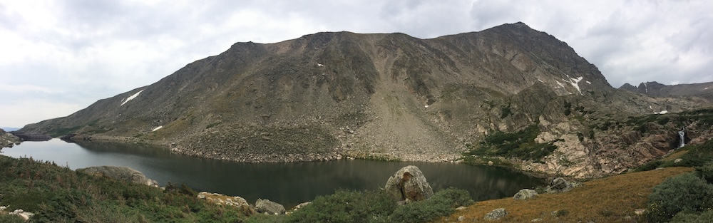
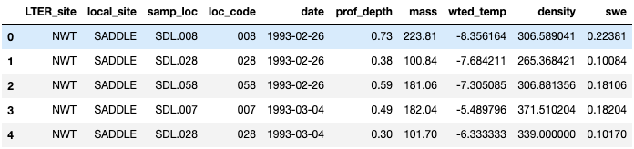
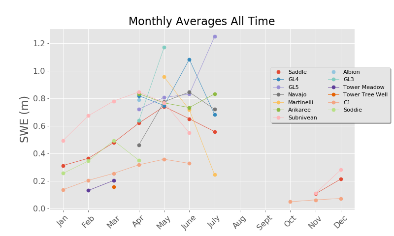
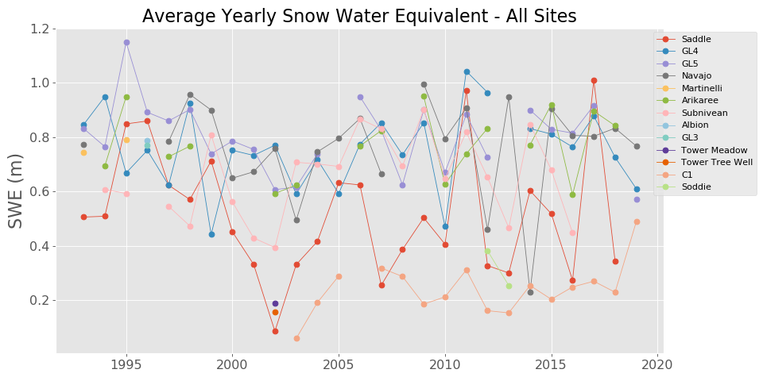
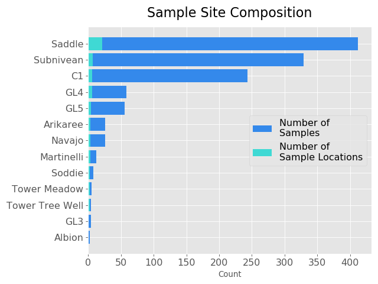
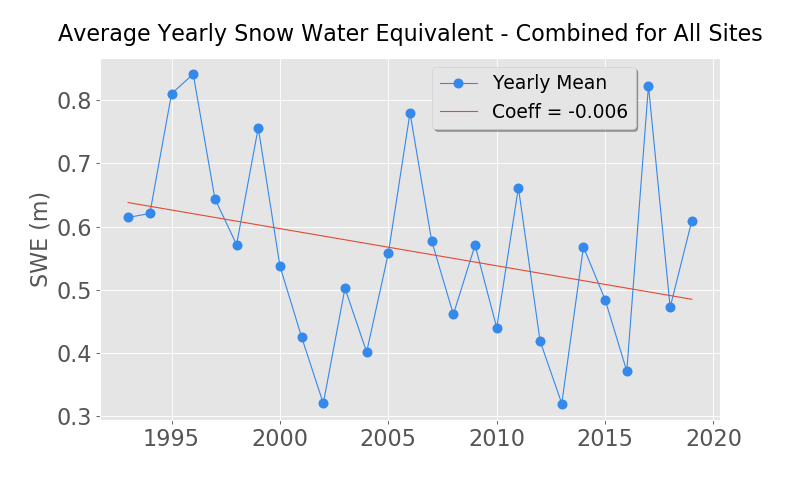
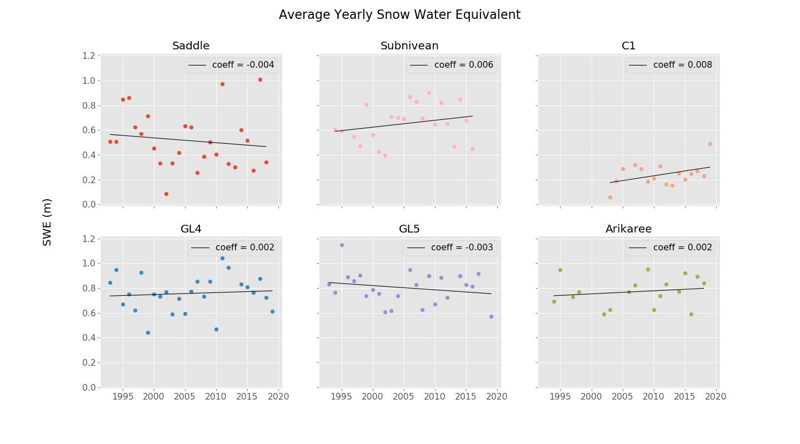

# Snow Water Equivalent
### *Capstone 1 - Annie Rumbles*

# Intro and Motivating Question
Several summers ago I worked at the [Niwot Ridge Long-term Ecological Research (LTER)](https://nwt.lternet.edu/) site as a field technician collecting data for various projects, so when this first capstone project came around, I thought it would be interesting in looking at some of the data collected at a site that I had a personal connection to. Niwot Ridge is located in the mountains of the Indian Peaks Wilderness area west of Boulder, Colorado. There are many cross-discipline, long-term research projects that are conducted in the Arapahoe and Roosevelt National Forests and the City of Boulder Watershed. These studies are crucial for understanding these ecosystems and helping to shed some light on what some of the climatological changes occurring at these higher elevations could mean for the future.

The specific data set I chose focuses on snow water equivalent (or SWE), which is a [measurement](https://www.nrcs.usda.gov/wps/portal/nrcs/detail/null/?cid=nrcseprd1314833) used to gauge the amount of liquid water contained within snow pack. Researchers started collecting these measurements in 1993 and this research continues today, so there is nearly 27 years worth of data to analyze. I was particularly interested if nearly three decades worth of data would be enough to reveal a trend in snow water equivalent. I was inclined to believe there may be decrease due to climatological changes that we have seen in the last couple of decades, so this is where I decided to base my hypothesis test: has snow water equivalent decreased at Niwot Ridge since 1993?

Part of the study area, the Green Lakes Valley, is an integral section of the City of Boulder watershed, so it is very important that there is sufficient snow pack, and therefore snow water equivalent, for the water needs of an entire city. If there were to be a significant decrease in snow water equivalent since 1993, that could have larger ramifications down the road.

# Raw Data and Exploratory Data Analysis
This data set contains about 2000 samples from 13 different sites at Niwot Ridge and in the Green Lakes Valley. Since this data set is a manageable size, I downloaded it onto my local machine, and imported the csv file into a pandas dataframe. The columns include: *LTER_site, local_site, samp_loc, loc_code, date, prof_depth, mass, wted_temp, density, and swe*. I was mainly interested in *swe* so I used that as my foundation. The 13 sample sites within the study area are: Saddle, GL4, GL5, Navajo, Martinelli, Arikaree, Subnivean, Albion, GL3, Tower Meadow, Tower Tree Well, C1, and Soddie, these are mapped below.

 

I decided to drop all rows that contained either all NaN values or a NaN value in the *swe* column because snow water equivalent was my main focus. I created a SampleSite class to organize the sites within the study, so I was working with one object per sample site (listed and shown above). I plotted monthly means of all 13 sites over all years to visualize when samples were taken, the majority of which is in the first half of the year, and only 3 sites sampled in October through December. I then proceeded to look mainly at annual means through the rest of my EDA. 

To visualize the mean SWE for each site, I plotted the yearly averages across all sites, there weren't any obvious patterns from viewing this way, and I noticed many of the sites had data that would stop and start:

 So in order to get a grasp of the distribution of sample sizes, I plotted the number of number of sample locations within the larger sample site area as well as the number of samples taken from 1993 through the end of 2019 (when the latest measurement was taken), so that I could turn my focus to the more well documented sites. I decided to choose the top 6 most "complete" sites, which you can see are: Saddle, Subnivean, C1, GL4, GL5, Arikaree, and Navajo.

# Analysis
I went on to perform a Stats Models, ordinary least squares linear regression for the average snow water equivalent combined for all sites over all years using only SWE as a parameter. While I did obtain a negative coefficient for my parameter, the associated p-value of .112, very low R2 value, and a confidence interval spanning [-0.013, 0.001]; I cannot reject the null hypothesis that the coefficient of this parameter is not just 0, therefore I cannot reject that there is no trend. There seems to be a very, very mild downward trend which may or may not become more pronounced as more data is collected in the next 10 years and beyond.

I also wanted to look at the trends of the top 6 sample sites, so I performed an OLS linear regressions for each site, again only using SWE as a parameter. The coefficient for the one parameter for each of the top 6 sites had a confidence interval containing 0, along with high p-values, which led me to conclude that at each of the top 6 sites, I cannot reject that there is no trend. 

# Conclusions
There was quite clearly no statistically significant decrease (or increase) in snow water equivalent at Niwot Ridge overall, or at the top 6 individual sample sites that I focused on, since 1993. I was looking at these data at quite a high level for this project and with the timeframe being relatively short in the climatological context, I'm not surprised there wasn't any sigificant decrease. I'll keep my eye on this data set and maybe several decades down the line there will be a quantifiable change to investigate and the impact therein. For now, the City of Boulder shouldn't need to water about their water needs. 

## Citations
Williams, M. 2019. Snow water equivalent data for Niwot Ridge and Green Lakes Valley, 1993 - ongoing. ver 16. Environmental Data Initiative. https://doi.org/10.6073/pasta/90c80003fafdce98ab33a4eea09fd9b6. Accessed 2020-03-31.